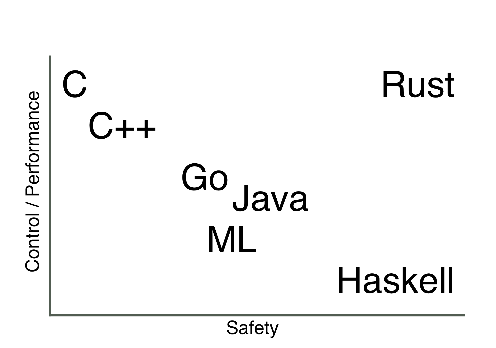
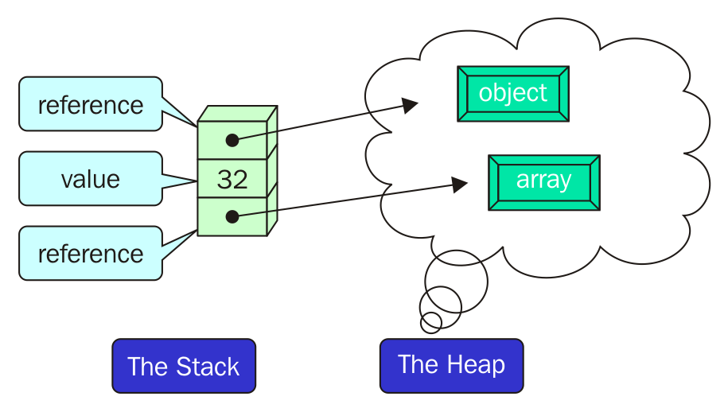

# Rust: programming language

---

# What is Rust?

“Rust is a systems programming language that runs blazingly fast, prevents segfaults, and guarantees thread safety.”


* Fast
* Prevents segfaults
* Thread safety

---

# History of Rust

* Started by Mozilla developer in circa 2006
* Sponzored by Mozilla since 2009
* Version 1.0 released in 2015
* Rust 2018 edition

---

# Characterization of Rust

* Compiled language built on top of LLVM toolchain
* No runtime overhead (No GC, dynamic typing etc.)
* Multi-paradigm - functional and OO aspects
* Strong type system
* Memory safe => ownership system
* Provides a lot of control, while maintaining safety

^ Rust is modern language, quite often it is being compared to Golang (started around same time)
^ It is compiled language
^ It focuses on having almost no runtime - meaning no garbage collection, static type system
^ Since it has no GC, it has to have some way of managing a memory, and that is ownership system which we'll cover
^ The whole idea of Rust is to provide a lot of control for the developer while providing more safety than C/C++

---

# Safety & Control



---

# How fast is fast?


---

# Ownership system

A compiler enforces a set of rules to manage memory without GC:

* Every resource has an owner (always only 1 at a time) who's responsible for managing it.
* When the owner goes out of scope, the resource will be dropped automatically.
* Others can borrow the resource from its owner.
* Owner cannot mutate or drop the resource while it's borrowed.
* Rust does this at compile time => no runtime errors.

---


# Stack vs heap

* Stack is LIFO - like plates. When code calls a function, the values passed into the function and function’s local variables get pushed onto the stack. When function is over, those values get popped of the stack.
* Data with size unknown at compile time are stored on the heap. You need to allocate a space to get it.
* Accessing data in the heap is slower than accessing data on the stack because you have to follow a pointer to get there.

---



---

# Let's look at examples

- Try out the Rust code yourself on [play.rust-lang.org](http://play.rust-lang.org)

---

# Ownership in action

```rust
fn print_vec(v: Vec<i32>) {
    println!("v is valid here! {:?}", v);
} // v is dropped/freed here

fn main() {
    let v = vec![1, 2, 3];
    print_vec(v);
    // Is v still usable here?!
    println!("v still here?! {:?}", v);
}
```

---

# Borrow of moved value?

```
error[E0382]: borrow of moved value: `v`
 --> src/main.rs:9:37
  |
7 |     print_vec(v);
  |               - value moved here
8 |     // Is v still usable here?!
9 |     println!("v still here?! {:?}", v);
  |                                     ^ value borrowed here after move
  |
  = note: move occurs because `v` has type `std::vec::Vec<i32>`, which does not implement the `Copy` trait
```

---

# Moving

- Rust will never implicitly create “deep” copies of your data.
- It "moves" the data instead - chaging the owner.
- The resource isn't usable after being moved - it's gone.
- One exception to "never copy" rule are scalar data types (stack-only data)

---

# Second attempt - let's borrow

```rust
fn print_vec(v: &Vec<i32>) {
    println!("v is valid here! {:?}", v);
} // v wasn't owned, so nothing happens

fn main() {
    let v = vec![1, 2, 3];
    print_vec(&v);
    // Since we didn't move v, but borrow, we can use v here
    println!("v still here?! {:?}", v);
}
```

---

# Ownership & function arguments

```rust
fn main() {
    let s = String::from(“oh my”); // s comes into scope
    takes_ownership(s);            // s’s values moves into the function, and it’s no longer valid here
    let x = 5;                     // x comes into scope
    makes_copy(x); // x would move into the function, but i32 is Copy, so it’s Ok to still
                   // use x afterwards
} // Here, x goes out of scope, then s. But because s’s values was moved, nothing special happens.

fn takes_ownership(some_str: String) { // some_str comes into scope
    println(“{}”, some_str);
} // Here, some_str goes out of scope and drop() is called. The memory is freed.

fn makes_copy(some_int: i32) { // some_int comes into scope
    println(“{}”, some_int);
} // some_int goes out of scope, nothing special happens.
```

---

# Ownership & return values

```rust
fn main() {
    let s1 = gives_ownership();         // gives_ownership moves its return
                                        // value into s1

    let s2 = String::from("hello");     // s2 comes into scope

    let s3 = takes_and_gives_back(s2);  // s2 is moved into
                                        // takes_and_gives_back, which also
                                        // moves its return value into s3
} // Here, s3 goes out of scope and is dropped. s2 goes out of scope but was
  // moved, so nothing happens. s1 goes out of scope and is dropped.

fn gives_ownership() -> String {             // gives_ownership will move its
                                             // return value into the function
                                             // that calls it

    let some_string = String::from("hello"); // some_string comes into scope

    some_string                              // some_string is returned and
                                             // moves out to the calling
                                             // function
}

// takes_and_gives_back will take a String and return one
fn takes_and_gives_back(a_string: String) -> String { // a_string comes into
                                                      // scope
    a_string  // a_string is returned and moves out to the calling function
}
```

---

# References

- Borrowing occurs via "taking a reference" without taking ownership
* It is valid only as long as the owner is valid. Rust enforces this at compile time via lifetimes.
- We've taken a reference/pointer to `v` and passed it to `print_vec`
- `print_vec` can read the value reference points to, but cannot modify it => immutability

---

# Immutability

- Everything in Rust is immutable by default
- `mut` is used to declare a resource as mutable
- One can borrow immutable (`&`) or mutable (`&mut`) but not both at the same time
- Multiple immutable references are okay and allowed.

---

# Mutable & immutable example

```rust
fn main() {
  let i = 5;      // Immutable by default
  let mut j = 10; // j is mutable by specifing `mut` keyword

  j = 15; // Cool.
  i = 10; // WRONG! Immutable.
}
```


---

# Ownership system summary

- Most of Rust's power comes from ownership system:
  - No runtime
  - Memory safety
  - Data race freedom
- Also, most of frustration with Rust will come from ownership system
- Not everything can be done while obeying Ownership => Rust offers `unsafe`


---

# Rust language basics


---

# Type system

- Statically typed language -> types need to be known at compiled time
- Type inferrence let's us get away without type when it can
- Scalar types: integers, floating-point numbers, Booleans, and characters
- Compound types: arrays and tuples
- Structs, enums, traits, ..

---

# Type inferrence

```rust
let t = true;      // bool type inferred by compiler
let i = 5;         // i32 inferred by the compiler
let j: i64 = 5;    // Explicitly bound with i64 type
let f = 1.0        // f has f64 type inferred

// Compiler inference hits its limit here, not possible to infer
let guess: u32 = "42".parse().expect("Not a number!");
```

---

# Arrays and tuples

- Array is a single chunk of memory allocated on the stack
- Arrays have a fixed length, once declared, they cannot grow or shrink in size!
- Every element of array must have same type.
- A vector is a similar to array, but can grow or shrink in size (vector is provided by stdlib).
- Tuple groups number of values with a variety of types into one compound type.

---

```rust
let a = [1, 2, 3]; // a is array of i32 values; [i32; 3]
let a = [0; 20];   // zero-filled array of length 20

let names = ["Joe", "Jane"]; // names: [&str; 2]
// Accessing array's item
println!("The first name is: {}", names[0])
// Lenght of an array
println!("Length of an array: {}", names.len());

// Tuples
let t = (1.0, 2, "wat");  // t is tuple of (f64, i32, &str)
// Accessing tuple's items
println!("The first item of tuple is: {}", t.0)

```

---

# Strings

* Strings are encoded in UTF-8
* Can be allocated on the heap (string objects) or stack (string literals)
* Two main types of strings you'll encounter - String objects and string slices
* String objects are "owned", allocated on the heap
* String slices are "window" into the string (can point to both heap and stack strings)

---

# String examples

```rust
// hello is &str string slice
let hello = "Hello, this is Rust &‘static str stored on the stack";

// s1 and s2 are both String objects
let s1 = "Hello, this will be String type".to_string();
let s2 = String::from("Hello, this will be String type");
```

---

# Control flow

- `if` expressions: conditions must evaluate to bool, Rust will not convert non-bool to bool.
- `loop`: tells Rust to execute a block of code over and over again until you explicitly tell it to stop.
- `while`: conditional loops
- `for` loop: used mostly with iterators

---

# If-else-if-else example

```rust
fn main() {
    let number = 6;

    if number % 4 == 0 {
        println!("number is divisible by 4");
    } else if number % 3 == 0 {
        println!("number is divisible by 3");
    } else if number % 2 == 0 {
        println!("number is divisible by 2");
    } else {
        println!("number is not divisible by 4, 3, or 2");
    }
}
```

---

# If as an expression

```rust
fn main() {
    let condition = true;
    let number = if condition {
        5
    } else {
        6
    };

    println!("The value of number is: {}", number);
}
```

---
# Loop expression

```rust
fn main() {
    let mut counter = 0;

    let result = loop {
        counter += 1;

        if counter == 10 {
            break counter * 2;
        }
    };

    assert_eq!(result, 20);
}
```

---

# Functions

- In functions signatures, type of each parameter must be declared.
- Functions are made up of statements optionally ending in an expression.
- Functions return last expression implicitly.
- Explicit returns from functions are done using return keyword.
- Passing a variable to a function move or copy.

---

# Function examples

```rust
fn display_str(str: &str) {
    println!("{}",str);
}

fn get_string() -> &'static str {
    "A string!"
}

fn main() {
    let string = get_string();
    display_str(string);
}
```

---

# Structs

- Structs let you create custom types that are meaningful for your domain.
- Struct keeps associated data connected to each other and name each piece to make your code clear.
- Methods let you specify the behaviour that instances of your structs have.
- Associated functions let you namespace functionality that is particular to your struct without having an instance available.

---

# Struct example

```rust
struct Point {
  x: i32,
  y: i32,
}

fn main() {
  let mut p = Point{ x: 0, y: 0 };
  p.x = 1;
  println!("The point is at ({}, {})", p.x, p.y);
}

```

---

# Struct tricks

```rust
// Field-init short-hand
let x = 5;
let p = Point { x, y: 2};

// Struct update syntax
let p1 = Point { x: 1, y: 0 };
let p2 = Point { x: 1, ..p1 };
```

---

# Methods

- Methods are defined within the context of a struct (or an enum or a trait object).
- The first parameter is always self - the instance of the struct the method is being called on.
- They can take ownership of self, borrow self immutably, or borrow self mutably, just as they can any other parameter.
- Associated functions are often used for constructors that will return a new instance of the struct.

---

```rust
struct Rectangle {
    width: f64,
    height: f64,
}

impl Rectangle {
    // Associated function new
    fn new(width: f64, height: f64) -> Rectangle {
        Rectangle { width, height }
    }

    // Borrow self immutably
    fn area(&self) -> f64 {
        self.width * self.height
    }

    // Borrow self mutably in order to change self
    fn scale(&mut self, factor: f64) {
        self.width *= factor;
        self.height *= factor;
    }
}
```

[Rust Playground](https://play.rust-lang.org/?version=stable&mode=debug&edition=2018&gist=bc3cdc7a07282135fec5574c871cd1eb)

---

# Enums

- Enums define a type by enumerating its possible values / variants
- Each enum variant can have a different type nested inside it
- Enum will take up the size of the maximum of its variants plus a value to know which variant it is

---

# Simple enum

```rust
enum IpAddrKind {
    V4,
    V6,
}

let four = IpAddrKind::V4;
let six = IpAddrKind::V6;
```

---

# Enum with data

```rust
enum IpAddrKind {
    V4(String),
    V6(String),
}

let four = IpAddrKind::V4(String::from("127.0.0.1")));
let six = IpAddrKind::V6(String::from("::1"));
```

---

# Complex enum example

```rust
enum DataSource {
    Flatfile,
    RedisChannel{ host: String, channel: String }, //Anonymous struct
    Postgres,
    Random,
}

let redis_ch = DataSource::RedisChannel {
    host: String::from("127.0.0.1"),
    channel: String::from("1")
};

```

---


# Option<T> aka Null

- There is no implicit null value in rust. Instead Rust has `Option<T>` type.
- Encodes common scenario in which a value could be something or it could be nothing.

```rust
enum Option<T> {
    Some(T),
    None,
}
```

---

# Pattern matching

- Match control flow operator allows to compare a value against a series of patterns and then execute code based on which pattern matches
- Matches in Rust are exhaustive: we must exhaust every last possibility in order for code to compile
- The `_` pattern will match any value (aka else)

```rust
match VALUE {
    PATTERN => EXPRESSION,
    PATTERN => EXPRESSION,
    PATTERN => EXPRESSION,
}
```

---

# Simple match example

```rust
enum Coin {
    Penny,
    Nickel,
    Dime,
    Quarter,
}

fn value_in_cents(coin: Coin) -> u32 {
    match coin {
        Coin::Penny => 1,
        Coin::Nickel => 5,
        Coin::Dime => 10,
        Coin::Quarter => 25,
    }
}
```

---

# Match w/ values

```rust
enum Message {
    Quit,
    Move { x: i32, y: i32 },
    Write(String),
    ChangeColor(i32, i32, i32),
}

fn process_message(msg: Message) {
    match msg {
        Message::Quit => quit(),
        Message::ChangeColor(r, g, b) => change_color(r, g, b),
        Message::Move {x: x, y: y} => move_cursor(x, y),
        Message::Write(s) => println!("{}", s),
    }
}
```

---

# `if let`: concise checking

* combines `if` and `let` into a less verbose way to handle values that match one pattern while ignoring the rest

```rust
let some = Some(5);

if let Some(n) = some {
    println!("there is some n: {}", n);
}
```

---

# Error handling

- Rust splits errors into two major categories: recoverable and unrecoverable.
- The type `Result<T, E>` is used for recoverable errors - common return value of functions/methods.
- panic! macro that stops execution when the program encounters an unrecoverable error.

---

# `Result<T, E>` struct

- Represents either a success (`Ok` variant) or failure (`Err` variant)
- Offers a ton of helper methods to evaluate the result

```rust
enum Result<T, E> {
    Ok(T),
    Err(E),
}
```

---

# Handling Result with `match`

```rust
use std::fs::File;

fn main() {
    let f = File::open("hello.txt");

    let f = match f {
        Ok(file) => file,
        Err(error) => {
            panic!("There was a problem opening the file: {:?}", error)
        },
    };
}
```

---

# Shortcuts: handling Result with `expect`

```rust
use std::fs::File;

fn main() {
    // Make sure Result from File::open is an Ok variant, otherwise panic!
    let f = File::open("hello.txt").expect("Failed to open hello.txt");
}
```

---

# Modules

- Rust module system is used to control scope and privacy
- Modules organize code into groups
- All items (functions, methods, structs, enums, modules, annd constants) are private by default.
- You can use the pub keyword to make an item public.

---

# Module example

```rust
mod plant {
    pub struct Vegetable {
        pub name: String,
        id: i32,
    }

    impl Vegetable {
        pub fn new(name: &str) -> Vegetable {
            Vegetable {
                name: String::from(name),
                id: 1,
            }
        }
    }
}

fn main() {
    let mut v = plant::Vegetable::new("squash");

    v.name = String::from("butternut squash");
    println!("{} are delicious", v.name);
}
```

---

# Generic data types

- Generics allow to use functions, structs, etc. with many different concrete data type
- Code using generic types doesn't run any slower than code with concrete type
- Monomorphization is the process of turning generic code into specific code by filling in the concrete types

---

# Simple generic struct example

```rust
struct Point<T> {
    x: T,
    y: T,
}

fn main() {
    let p = Point { x: 5.0, y: 4.0 };
}
```

---

# Generics in methods

```rust
struct Point<T> {
    x: T,
    y: T,
}

impl<T> Point<T> {
    fn x(&self) -> &T {
        &self.x
    }
}

fn main() {
    // pi will be Point<i32>
    let pi = Point { x: 5, y: 10 };
    // pf will be Point<f64>
    let pf = Point { x: 3.0, y: 7.0 };

    println!("pi.x = {}", pi.x());
    println!("pf.x = {}", pf.x());
}
```

---

# Traits

- Trait tells the Rust compiler about functionality a particular type has
- They are similar to a feature often called interfaces in other languages

---

# Trait examples

```rust
pub trait Summary {
    fn summarize(&self) -> String;
}

pub struct NewsArticle {
    pub headline: String,
    pub location: String,
    pub author: String,
    pub content: String,
}

impl Summary for NewsArticle {
    fn summarize(&self) -> String {
        format!("{}, by {} ({})", self.headline, self.author, self.location)
    }
}
```

---

# Trait as an argument

- Same result: first via impl keyword, second via so called trait bound

```rust
pub fn notify(item: impl Summary) {
    println!("Breaking news! {}", item.summarize());
}

pub fn notify<T: Summary>(item: T) {
    println!("Breaking news! {}", item.summarize());
}
```

---

# Trait - default implementation

```rust
pub trait Summary {
    fn summarize_author(&self) -> String;

    fn summarize(&self) -> String {
        format!("(Read more from {}...)", self.summarize_author())
    }
}
```

---

# Closures

* Closures are anonymous functions that you can save in variable or pass as an argument
* As you would expect, closures can captures values from the scope in which they're defined
* It's not required to annotate the types of parameters or return value (unlike functions). Compiler is able to infer the types.
* Type annotations can be added if we want to increase explicitness and clarity at cost of being more verbose than is strictly necessary.

---

# Closures - cont.

* Closures can capture values in 3 ways: taking ownership, borrowing mutably, and borrowing immutably.
* Closure definitions will have one concrete type inferred for each of their parameter and return value. If you try to call closure with different types results into compiler error.

---

# Closure syntax

```rust
let add_one_v2 = |x: u32| -> u32 { x + 1 };
let add_one_v3 = |x|             { x + 1 };
let add_one_v4 = |x|               x + 1  ;
```

---

# Storing closures in struct

```rust
struct Cacher<T>
        where T: Fn(u32) -> u32
{
        calculation: T,
        value: Option<u32>
}
```

---

# Iterators

* Iterator patterns allows to perform some task on a sequence of items in turn
* They are lazy, meaning they have no effect until you call methods that consume the iterator.
* All iterators implement a trait named `Iterator` from the standard library.


```rust
let v1 = vec![1, 2, 3];

for val in v1.iter() {
    println!("Got: {}", val);
}
```

---

# Iterator example

```rust
let names = vec!["Jane", "Jill", "Jack", "John"];

let total_len = names
    .iter()
    .map(|name| name.len())
    .fold(0, |acc, len| acc + len );

assert_eq!(total_len, 16);

```

---

# Concurrency

* Rust is thread safe by design thanks to ownership system - no race conditions, deadlocks, ...
* The language itself supports 1:1 native threads only (remember, no runtime)
* Concurrent models: Message passing via channels, shared-state
* Other concurrency models provided by other libraries

---

# Threads & channels example

```rust
use std::thread;
use std::sync::mpsc;

fn main() {
    let (tx, rx) = mpsc::channel();

    thread::spawn(move || {
        let val = String::from("hi");
        tx.send(val).unwrap();
    });

    let received = rx.recv().unwrap();
    println!("Got: {}", received);
}
```

---

# Shared state via Mutex<T>

```rust
use std::sync::{Mutex, Arc};
use std::thread;

fn main() {
    let counter = Arc::new(Mutex::new(0));
    let mut handles = vec![];

    for _ in 0..10 {
        let counter = Arc::clone(&counter);
        let handle = thread::spawn(move || {
            let mut num = counter.lock().unwrap();

            *num += 1;
        });
        handles.push(handle);
    }

    for handle in handles {
        handle.join().unwrap();
    }

    println!("Result: {}", *counter.lock().unwrap());
}
```

---

# Meta-programming

* Rust offers attributes and macros as a powerful tools for meta-programming.
* println! is macro
* Macros can take variable number of arguments (functions not)
* Declarative and procedural macros

---

# Attribute example

```rust
#[derive(Debug)]
struct Meter(f64);

impl Meter {
    fn new(m: f64) -> Meter {
        Meter(m)
    }
}

fn main() {
    let m = Meter::new(3.7);
    println!("{:?}", m);
    dbg!(m);
}
```

---

# Testing

* Rust provides built-in testing framework: `cargo test`
* `cargo tests` runs tests in parallel by default
* `assert!`, `assert_eq!` and `assert_ne!` macros provided
* `should_panic` attribute sets expectation for panicing code
* Unit tests are stored in the same file as the functionality

---

# Test example

```rust
pub fn greeting(name: &str) -> String {
    format!("Hello {}!", name)
}

#[cfg(test)]
mod tests {
    use super::*;

    #[test]
    fn greeting_contains_name() {
        let result = greeting("Carol");
        assert!(result.contains("Carol"));
    }
}
```

---

# Doc-tests

* Automatically run with `cargo test`

```rust
/// # Examples
/// ```
/// let stk = SLStack::<u32>::new();
/// assert!(stk.pop() == None);
/// ```
fn pop(&mut self) -> Option<Box<T>> {
    ...
}
```

---

# Where to use rust?

- WebAssembly - WASM target
- AWS Lambda - runtime added few months ago
- Embedded

---

# Diesel.rs

* Diesel is a Safe, Extensible ORM and Query Builder for Rust
* Inspiration in Rails & Active Record
* Supports Postgres, Mysql and Sqlite.

```rust
users::table.load(&connection)
// => "SELECT * FROM users;"
```

---

# Iron - web framework

* Described as "high level" web framework, but do not expect much. Batteries not included.
* Highly concurrent and scalable horinzontally
* Avoids bottlenecks in highly concurrent code by avoiding shared writes and locking in the core framework.
* Meant to be as extensible and pluggable as possible; Iron's core avoids unnecessary features by leaving them to middleware, plugins, and modifiers.

---

# Iron example

```rust
extern crate iron;

use iron::prelude::*;
use iron::status;

fn main() {
    Iron::new(|_: &mut Request| {
        Ok(Response::with((status::Ok, "Hello World!")))
    }).http("localhost:3000").unwrap();
}
```

---

# Let's code a simple user create service

